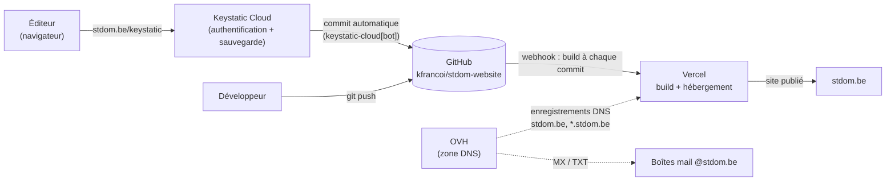

# Site de l'unité Saint-Dominique — stdom.be

Site web de l'unité Saint-Dominique : **67ème Guide** et **106ème Scout**.
Ce document est le point d'entrée pour toute personne qui reprend la gestion du site, qu'elle soit à l'aise avec le code ou non.

- [1. L'essentiel en 2 minutes](#1-lessentiel-en-2-minutes)
- [2. Architecture](#2-architecture)
- [3. Les comptes à connaître (et à transmettre)](#3-les-comptes-à-connaître-et-à-transmettre)
- [4. Modifier le contenu (sans code)](#4-modifier-le-contenu-sans-code)
- [5. Tâches courantes](#5-tâches-courantes)
- [6. Vercel : hébergement et déploiement](#6-vercel--hébergement-et-déploiement)
- [7. OVH : le nom de domaine et le DNS](#7-ovh--le-nom-de-domaine-et-le-dns)
- [8. Sous-domaines des sections](#8-sous-domaines-des-sections)
- [9. Développer en local](#9-développer-en-local)
- [10. Structure du dépôt](#10-structure-du-dépôt)
- [11. Dépannage](#11-dépannage)
- [12. Points d'attention et dette technique](#12-points-dattention-et-dette-technique)
- [13. Décisions d'architecture](#13-décisions-darchitecture)

---

## 1. L'essentiel en 2 minutes

| Question | Réponse |
|---|---|
| Où modifier un texte, un événement, un staff ? | `https://stdom.be/keystatic` (connexion avec un compte Keystatic Cloud) |
| Où est le code ? | GitHub : `kfrancoi/stdom-website` (branche `main`) |
| Qui héberge le site ? | **Vercel** (formule gratuite) |
| Qui gère le nom de domaine `stdom.be` ? | **OVH** (le domaine et sa zone DNS uniquement) |
| Combien de temps avant qu'une modification soit visible ? | Quelques minutes : chaque sauvegarde déclenche un nouveau déploiement |
| Faut-il un compte GitHub pour éditer ? | **Non.** Seuls les mainteneurs techniques en ont besoin |

Le principe : **le contenu est stocké sous forme de fichiers dans le dépôt GitHub**. Il n'y a pas de base de données. Keystatic est l'interface qui permet d'éditer ces fichiers depuis un navigateur ; Vercel reconstruit le site dès que les fichiers changent.

## 2. Architecture



### Les briques techniques

| Brique | Rôle |
|---|---|
| **[Astro](https://astro.build) 5** | Génère le site. Les pages publiques sont **pré-générées** (HTML statique) au moment du build |
| **Tailwind CSS 3** + `@tailwindcss/typography` | Mise en forme (couleurs de l'unité définies dans `tailwind.config.mjs`) |
| **[Keystatic](https://keystatic.com)** | Interface d'édition du contenu, servie sur `/keystatic` |
| **Markdoc** | Format des textes riches (histoire, chartes, grand camp…) |
| **`@astrojs/vercel`** | Adaptateur de déploiement Vercel (runtime Node 22) |

### Ce qui est statique, ce qui ne l'est pas

- **Statique** (HTML pré-généré, très rapide, rien à maintenir) : toutes les pages publiques — accueil, sections, calendrier, pratique, documents…
- **Serverless** (s'exécute à la demande sur Vercel) : uniquement l'admin `/keystatic` et son API `/api/keystatic`. Les fonctions sont épinglées en région Paris (`cdg1`, dans `vercel.json`).
- **Images** : optimisées à la volée par Vercel (`/_vercel/image`, formats AVIF/WebP), configurées dans `astro.config.mjs`. Inutile de recompresser les photos à la main.

### Deux modes pour Keystatic

Défini dans `keystatic.config.ts` :

| Contexte | Mode | Comportement |
|---|---|---|
| `npm run dev` (ordinateur) | `local` | Édite directement les fichiers du dossier, **sans connexion** |
| Production (stdom.be) | `cloud` | Connexion via Keystatic Cloud ; chaque sauvegarde crée un **commit** sur GitHub |

Aucune variable d'environnement n'est nécessaire : ni sur Vercel, ni en local.

## 3. Les comptes à connaître (et à transmettre)

> ⚠️ **À compléter lors de la passation.** Ce tableau doit toujours indiquer qui détient réellement chaque accès. Un compte qui n'appartient qu'à une seule personne est un risque pour l'unité.

| Service | À quoi il sert | Adresse / projet | Titulaire(s) à ce jour |
|---|---|---|---|
| **GitHub** | Stocke le code **et** le contenu | `github.com/kfrancoi/stdom-website` | Kevin Françoisse — *à compléter : co-propriétaire ?* |
| **Vercel** | Build et hébergement | *projet à compléter (nom exact dans le tableau de bord Vercel)* | *à compléter* |
| **Keystatic Cloud** | Connexion des éditeurs | Projet `saint-dom/stdom-website` ([keystatic.cloud](https://keystatic.cloud)) | *à compléter* |
| **OVH** | Nom de domaine `stdom.be` + DNS (+ mails ?) | [ovh.com/manager](https://www.ovh.com/manager) | *à compléter* |

**Recommandations pour la passation :**

1. Chaque service doit avoir **au moins deux personnes** en droits d'administration.
2. Sur GitHub : ajouter la personne en *collaborateur* (ou transférer le dépôt vers une organisation de l'unité).
3. Sur Vercel : inviter la personne dans l'équipe du projet (ou transférer le projet).
4. Sur Keystatic Cloud : ajouter chaque éditeur dans l'équipe (voir [Ajouter un éditeur](#ajouter-un-éditeur)).
5. Sur OVH : enregistrer un contact administratif/technique de secours pour le domaine — **le renouvellement annuel du domaine est critique** : s'il expire, le site et les adresses mail disparaissent.

## 4. Modifier le contenu (sans code)

### Se connecter

1. Aller sur **`https://stdom.be/keystatic`**
2. Se connecter avec son compte Keystatic Cloud
3. Modifier, puis cliquer sur **Save** (Enregistrer)
4. Attendre quelques minutes : le site se reconstruit automatiquement

> Vous devez avoir été **ajouté à l'équipe Keystatic Cloud** pour pouvoir vous connecter (voir [Ajouter un éditeur](#ajouter-un-éditeur)).

### Que modifier, et où ça apparaît

| Menu Keystatic | Contenu | Page du site |
|---|---|---|
| Actualités → **Infos flash** | Annonces en bandeau, avec date d'expiration | Accueil |
| Actualités → **Événements** | Calendrier de l'année | `/calendrier` + « Prochains événements » en accueil |
| Unité → **Staffs d'unité & ASBL** | Staff 67, staff 106, conseil d'administration ASBL | `/unite`, `/asbl`, `/contact` |
| Unité → **Histoire** | Texte riche | `/unite` |
| Unité → **Présence & engagement** | Texte riche | `/unite` |
| Sections → **67ème / 106ème** | Description, contacts, staff, visuel, photos de chaque section | `/sections` et `/sections/<unité>/<section>` |
| Pratique → **Inscriptions** | Case « ouvertes » + message d'information | `/pratique` |
| Pratique → **Grand camp / Cotisations / Uniformes** | Textes riches | `/pratique` |
| Documents → **Téléchargements** | PDF à télécharger (fiche santé, autorisations, outils…) | `/documents` |
| Documents → **Chartes** | Les 3 chartes (scoutisme, totémisation, chef) | `/documents`, `/chartes/<nom>` |
| Documents → **Liens utiles** | Liens externes classés par catégorie | `/documents` |

### Ajouter un éditeur

1. Aller sur [keystatic.cloud](https://keystatic.cloud) avec un compte **administrateur** de l'équipe
2. Ouvrir l'équipe, puis le projet `saint-dom/stdom-website`
3. Inviter la personne par email (Members / Invite)
4. Elle crée son compte et peut ensuite se connecter sur `stdom.be/keystatic`

> Le nombre d'éditeurs gratuits est limité par la formule de Keystatic Cloud (3 au moment de la mise en place). **Vérifier la grille tarifaire actuelle** avant d'inviter davantage de monde.

## 5. Tâches courantes

### Mettre à jour le calendrier de l'année

*Keystatic → Actualités → Événements.* Un fichier par événement : titre, date (et dernier jour si l'événement dure plusieurs jours), catégorie, unité concernée (67, 106 ou les deux). Les événements passés se grisent automatiquement dans le calendrier ; ils n'ont pas besoin d'être supprimés.

### Ouvrir / fermer les inscriptions

*Keystatic → Pratique → Inscriptions.*

- Case **décochée** : les boutons d'inscription de la page Pratique sont grisés
- Case **cochée** : les boutons sont actifs
- Le champ *message* s'affiche au-dessus des boutons (vide = aucun message)

### Publier une info flash

*Keystatic → Actualités → Infos flash.* Renseigner un titre, un message, et idéalement **« Afficher jusqu'au »** pour que l'annonce disparaisse d'elle-même (voir l'[avertissement sur les dates](#les-contenus-dépendant-de-la-date-ne-se-rafraîchissent-quau-déploiement)).

### Ajouter un document à télécharger

*Keystatic → Documents → Téléchargements → Create.* Choisir la catégorie et envoyer le PDF. Il est publié dans `public/documents/`.

### Mettre à jour les staffs (rentrée)

*Keystatic → Unité → Staffs d'unité & ASBL* pour les staffs d'unité et le CA de l'ASBL, et *Sections → [section] → Staff* pour les staffs de section. Les chefs d'unité de `/contact` sont retrouvés par **totem** : si le chef d'unité change, mettre aussi à jour `src/pages/contact.astro`, sinon le déploiement échoue (voir [Dépannage](#11-dépannage)).

### Ajouter une nouvelle section

1. *Keystatic → Sections → 67ème (ou 106ème) → Create.* Le **nom** de la section détermine son *slug* (l'adresse de la page, ex. `Les Amazones` → `amazones`). Renseigner type, description, contact, ordre d'affichage, staff, et le **visuel de thème** (envoyé dans `public/images/art_sections/`).
2. La page `/sections/<unité>/<slug>` est créée automatiquement.
3. **Étape manuelle, non automatique** — si on veut un sous-domaine `<slug>.stdom.be` : voir [section 8](#8-sous-domaines-des-sections).

### Changer un texte « en dur » (hors Keystatic)

Certains textes ne sont pas éditables via Keystatic car ils vivent directement dans le code des pages (`src/pages/*.astro`) : par exemple la FAQ et les étapes d'inscription dans `pratique.astro`, les projets de l'ASBL dans `asbl.astro`, ou les coordonnées du pied de page dans `Footer.astro`. Les modifier demande de toucher au code (voir [section 9](#9-développer-en-local)).

### Les contenus dépendant de la date ne se rafraîchissent qu'au déploiement

Les pages publiques sont générées **au moment du build**. Conséquence :

- la liste « **Prochains événements** » de l'accueil est calculée à la date du dernier build ;
- une **info flash** arrivée à expiration reste affichée tant que le site n'a pas été reconstruit ;
- le grisage des événements passés dans `/calendrier` suit le même principe.

Tant que quelqu'un édite régulièrement, tout est à jour. En période calme, **forcer un nouveau déploiement** : Vercel → projet → *Deployments* → menu `⋯` du dernier déploiement → **Redeploy**.
*(Amélioration possible : un « Deploy Hook » Vercel déclenché chaque nuit par un planificateur gratuit pour automatiser cela.)*

## 6. Vercel : hébergement et déploiement

### Principe

Le projet Vercel est connecté au dépôt GitHub. **Chaque commit sur `main` déclenche automatiquement un build et un déploiement en production.** Il n'y a aucune commande de déploiement à lancer.

| | |
|---|---|
| Framework détecté | Astro |
| Commande de build | `npm run build` (→ `astro build`) |
| Version de Node | 22.x |
| Région des fonctions | Paris (`cdg1`) — fichier `vercel.json` |
| Variables d'environnement | Aucune |

### Opérations courantes

- **Voir l'état d'un déploiement / les logs de build** : tableau de bord Vercel → projet → *Deployments*
- **Revenir à une version précédente** (en cas de problème) : *Deployments* → choisir un déploiement qui fonctionnait → `⋯` → **Promote to Production** (ou *Instant Rollback*). C'est immédiat et sans risque
- **Forcer un redéploiement** : *Deployments* → `⋯` → **Redeploy**
- **Gérer les domaines** : projet → *Settings* → *Domains*

### Chaque commit déploie

Que le commit vienne d'un développeur (`git push`) ou d'un éditeur (`keystatic-cloud[bot]`), le résultat est identique. Si un contenu mal formé casse le build, **l'ancienne version reste en ligne** : Vercel ne remplace la production que si le build réussit. L'erreur est visible dans les logs du déploiement.

## 7. OVH : le nom de domaine et le DNS

### Ce qu'OVH fait (et ne fait plus)

- ✅ **Fait** : enregistrement du nom de domaine `stdom.be` et **hébergement de la zone DNS** (c'est la zone DNS qui dit au monde où se trouve le site)
- ❌ **Ne fait plus** : héberger le site. L'ancien hébergement mutualisé OVH a été abandonné — il ne peut pas exécuter Node.js (indispensable à l'admin Keystatic) ni se reconstruire à chaque modification. Le site ne dépend plus de lui.

> ⚠️ **Ne résiliez pas l'hébergement OVH ni le domaine sans vérifier au préalable** que les adresses mail `@stdom.be` (administration67@, inscriptions106@, etc.) n'en dépendent pas.

### Enregistrements DNS attendus

À modifier dans **OVH Manager → Noms de domaine → stdom.be → Zone DNS**.

| Type | Nom | Valeur | Rôle |
|---|---|---|---|
| `A` | `stdom.be` (racine) | `76.76.21.21` | Site principal sur Vercel |
| `CNAME` | `www` | `cname.vercel-dns.com.` | `www.stdom.be` (redirigé vers `stdom.be`) |
| `CNAME` | `<section>` | `cname.vercel-dns.com.` | Un par sous-domaine de section (voir section 8) |

> **Les valeurs ci-dessus sont les valeurs standard de Vercel.** Elles peuvent évoluer : en cas de doute, **la référence est toujours Vercel → projet → Settings → Domains**, qui affiche les enregistrements exacts à créer et indique si le domaine est correctement configuré.

> ⚠️ **Ne supprimez ni ne modifiez jamais les enregistrements `MX`, `TXT` (SPF, DKIM, DMARC) ou `CNAME` liés au mail** : ils font fonctionner les adresses `@stdom.be`. Pour changer le site, on ne touche qu'aux enregistrements `A` de la racine et aux `CNAME` des sous-domaines.

### Vérifier que tout est en ordre

- Vercel → *Settings* → *Domains* : chaque domaine doit afficher **Valid Configuration**
- Le certificat HTTPS est délivré et renouvelé **automatiquement** par Vercel, il n'y a rien à faire
- Un changement DNS peut mettre de quelques minutes à quelques heures à se propager

### Renouvellement

Le nom de domaine se renouvelle **chaque année** chez OVH. Vérifier que le renouvellement automatique est activé et que les emails d'alerte d'OVH arrivent à une adresse **surveillée par plusieurs personnes**, pas à une boîte personnelle.

## 8. Sous-domaines des sections

Chaque section dispose d'une adresse courte `<slug>.stdom.be` (ex. `amazones.stdom.be`) qui **redirige** (HTTP 307) vers sa page : `https://stdom.be/sections/67eme/amazones`.

### Comment ça marche

Les règles se trouvent dans [`vercel.json`](vercel.json) : une règle par unité, qui repère le sous-domaine par une liste de noms séparés par `|` et redirige vers la bonne page.

```json
"value": "(?<section>amazones|durandal|eldorado|…)\\.stdom\\.be"
"destination": "https://stdom.be/sections/67eme/:section"
```

Sections actuellement déclarées :

- **67ème** : amazones, durandal, eldorado, farfadets, gavroches, himalaya, soleil-levant, tarentelle
- **106ème** : abeilles, aigles, chevalerie, clinfoc, dhak, merlin, mickey, rocher, serengeti

### Pourquoi pas un joker `*.stdom.be` ?

Un joker obligerait à déléguer toute la zone DNS à Vercel (donc à sortir le DNS d'OVH, avec les risques pour les mails). Les sous-domaines sont donc déclarés **un par un**. C'est volontaire.

### ➕ Ajouter le sous-domaine d'une nouvelle section

Créer une section dans Keystatic **ne crée pas son sous-domaine**. Trois étapes :

1. **`vercel.json`** : ajouter le *slug* dans la liste de la bonne unité (règle 67ème ou 106ème), puis commit/push
2. **Vercel** → projet → *Settings* → *Domains* → **Add** → `<slug>.stdom.be`
3. **OVH** → Zone DNS → ajouter un `CNAME` : nom `<slug>`, valeur `cname.vercel-dns.com.`

Si l'une des trois étapes manque, le sous-domaine ne fonctionne pas : sans l'étape 1 il n'y a pas de redirection, sans l'étape 2 Vercel refuse la requête, sans l'étape 3 l'adresse n'existe pas dans le DNS.

> Le *slug* dans `vercel.json` doit être **identique** au nom du fichier dans `src/content/sections67/` (ou `sections106/`).

## 9. Développer en local

Pour modifier le code, ou éditer le contenu depuis son ordinateur.

### Prérequis

- [Node.js](https://nodejs.org) **22** (la version utilisée par Vercel)
- Git, et un accès au dépôt GitHub

### Démarrage

```bash
git clone git@github.com:kfrancoi/stdom-website.git
cd stdom-website
npm install
npm run dev
```

| Adresse | Contenu |
|---|---|
| http://localhost:4321 | Le site |
| http://localhost:4321/keystatic | L'admin en **mode local** (sans connexion, écrit directement dans les fichiers) |

### Commandes

| Commande | Effet |
|---|---|
| `npm run dev` | Serveur de développement avec rechargement à chaud |
| `npm run build` | Construit le site comme sur Vercel (dans `dist/` et `.vercel/output/`) |
| `npm run preview` | Prévisualise le build |

**Avant de pousser un changement de code, lancer `npm run build`** : si le build échoue chez vous, il échouera chez Vercel (sans conséquence pour le site en ligne, mais le déploiement sera refusé).

### Workflow Git

- La branche de production est **`main`** : tout ce qui y arrive est publié
- Les éditeurs Keystatic Cloud committent directement sur `main` (auteur `keystatic-cloud[bot]`) — **toujours faire `git pull` avant de commencer à travailler**, sinon le `push` sera rejeté
- Pour un changement de code important, préférer une branche + *pull request* : Vercel crée automatiquement un **déploiement de prévisualisation** (URL temporaire) pour la tester avant fusion
- Si vous éditez du contenu en local via `/keystatic`, il faut ensuite **committer et pousser** les fichiers modifiés

## 10. Structure du dépôt

```
.
├── keystatic.config.ts      ← Définition de TOUT le contenu éditable (champs, collections, menus)
├── astro.config.mjs         ← Configuration Astro (intégrations, adaptateur Vercel, images)
├── vercel.json              ← Région des fonctions + redirections des sous-domaines
├── tailwind.config.mjs      ← Couleurs de l'unité et plugin typographie
├── package.json
│
├── src/
│   ├── content/             ← LE CONTENU (édité via Keystatic, un fichier par entrée)
│   │   ├── evenements/      ·  un fichier JSON par événement du calendrier
│   │   ├── sections67/      ·  une section 67ème par fichier
│   │   ├── sections106/     ·  une section 106ème par fichier
│   │   ├── flashs/          ·  infos flash
│   │   ├── documents/       ·  métadonnées des PDF à télécharger
│   │   ├── chartes/         ·  chartes (Markdoc)
│   │   ├── liens/           ·  liens utiles
│   │   ├── pages/           ·  textes riches (histoire, présence, grand camp, cotisations, uniformes)
│   │   ├── staffs.json      ·  staffs d'unité + conseil d'administration ASBL
│   │   └── inscriptions.json·  état des inscriptions + message
│   │
│   ├── lib/content.ts       ← Couche de lecture : transforme le contenu en données pour les pages
│   ├── pages/               ← Une page = un fichier (l'URL suit le nom du fichier)
│   ├── components/          ← Briques réutilisables (en-tête, pied de page, cartes…)
│   ├── layouts/             ← Squelette HTML commun
│   └── styles/global.css
│
└── public/                  ← Fichiers servis tels quels
    ├── documents/           ·  PDF à télécharger
    └── images/              ·  logo, hero, visuels de sections, images des textes riches
```

### Comment le contenu circule

```
keystatic.config.ts  ──définit──▶  src/content/*  ──lu par──▶  src/lib/content.ts  ──utilisé par──▶  src/pages/*.astro
   (le schéma)                      (les données)               (la couche de lecture)                 (l'affichage)
```

**Règle d'or : si on ajoute ou renomme un champ**, il faut modifier les **trois** : le schéma (`keystatic.config.ts`), la lecture (`src/lib/content.ts`) et la page qui l'affiche.

### Fichiers de contenu

Les noms de fichiers sont des *slugs* (minuscules, sans accent, tirets) — c'est eux qui forment les URL. Les fichiers JSON sont générés par Keystatic : on peut les éditer à la main, mais mieux vaut passer par l'interface pour éviter une erreur de format.

## 11. Dépannage

| Symptôme | Cause probable | Que faire |
|---|---|---|
| Je ne peux pas me connecter à `/keystatic` | Compte non ajouté à l'équipe Keystatic Cloud | Un admin de l'équipe doit vous inviter ([section 4](#ajouter-un-éditeur)) |
| Ma modification n'apparaît pas | Le build n'est pas terminé, ou a échoué | Vercel → *Deployments* : regarder l'état et les logs du dernier déploiement |
| Le dernier déploiement est en erreur | Contenu ou code invalide | Lire le log. L'ancienne version reste en ligne ; corriger puis re-sauvegarder, ou annuler le dernier commit |
| « Prochains événements » ou une info flash périmée s'affichent encore | Pages figées au dernier build | **Redeploy** depuis Vercel ([détail](#les-contenus-dépendant-de-la-date-ne-se-rafraîchissent-quau-déploiement)) |
| Une image s'affiche cassée (404) | Image rangée dans un dossier non publié | Les images doivent se trouver dans `public/` ; ne pas les déplacer à la main |
| `git push` rejeté | Un éditeur a modifié le contenu depuis votre dernier `git pull` | `git pull --rebase` puis `git push` |
| `nouveau-slug.stdom.be` ne fonctionne pas | Une des 3 étapes manque | Reprendre la [procédure de la section 8](#-ajouter-le-sous-domaine-dune-nouvelle-section) |
| Le site ne répond plus du tout sur `stdom.be` | DNS modifié, domaine expiré ou problème Vercel | 1. [vercel-status.com](https://www.vercel-status.com) 2. Vercel → Domains (configuration valide ?) 3. OVH : domaine renouvelé ? zone DNS inchangée ? |
| Le déploiement échoue après un changement de chef d'unité (totem modifié ou staff réorganisé) | `contact.astro` retrouve les chefs d'unité **par totem** (`Tupaïa` côté 67, `Almiki` côté 106) ; si le totem n'existe plus dans le staff, le build plante (l'ancienne version reste en ligne) | Mettre à jour les deux totems en haut de `src/pages/contact.astro` |

### Annuler une mauvaise modification

- **Contenu ou code** : dans l'historique GitHub (`Commits`), ouvrir le mauvais commit → **Revert**. Vercel redéploie la version précédente
- **Urgence** : Vercel → *Deployments* → promouvoir un ancien déploiement (immédiat)

## 12. Points d'attention et dette technique

Constats faits lors de la rédaction de ce document, à traiter quand le temps le permet :

- **`public/.htaccess` est obsolète.** Il date de l'ancien hébergement Apache chez OVH et n'est pas utilisé par Vercel. Il peut être supprimé sans risque.
- **`tsconfig.json` référence un alias `@data/*` → `src/data/*`**, dossier supprimé lors de la migration vers Keystatic. Sans effet, mais à nettoyer.
- **`tsx`** figure dans les dépendances de développement : c'était utile pour la migration initiale des données, plus nécessaire.
- **Textes en dur** (FAQ, étapes d'inscription, projets de l'ASBL, pied de page) : non éditables dans Keystatic. À migrer vers des collections si les non-développeurs doivent les maintenir.
- **Rafraîchissement par date** : voir [l'avertissement](#les-contenus-dépendant-de-la-date-ne-se-rafraîchissent-quau-déploiement) ; un redéploiement planifié résoudrait le problème.
- **Mises à jour de dépendances** : `npm audit` signale régulièrement des alertes. Sur un site statique leur impact est limité, mais prévoir une mise à jour annuelle (`npm update`, puis `npm run build`).
- **Fonctionnalités reportées** (décision de 2026, volontairement hors périmètre) : **newsletter** et **vente/dons d'uniformes (e-shop)**.
- **Visuels de section** : le champ s'appelle « Visuel de thème (en attendant le balzon) » — il est prévu de le remplacer par les vraies photos/illustrations des sections.

## 13. Décisions d'architecture

Pour comprendre *pourquoi* les choses sont ainsi, et éviter de défaire sans le savoir un choix réfléchi.

| Décision | Raison |
|---|---|
| **Contenu en fichiers dans Git, pas de base de données** | Rien à héberger ni à sauvegarder séparément ; historique complet et annulation gratuits ; le contenu et le code évoluent ensemble |
| **Keystatic** plutôt que Sanity, Payload ou Decap | Sanity : dépendance externe pour des données qui tiennent dans le dépôt. Payload : exige de faire tourner un serveur et une base de données. Decap : peu maintenu. Keystatic s'intègre nativement à Astro et stocke dans Git |
| **Keystatic Cloud** en production | Permet aux membres de l'unité d'éditer **sans compte GitHub**. Chaque sauvegarde devient un commit |
| **Vercel** plutôt que l'hébergement mutualisé OVH | L'hébergement mutualisé ne peut pas exécuter Node.js (admin Keystatic) ni rebuilder à chaque commit |
| **OVH conservé pour le domaine uniquement** | Le domaine et ses adresses mail y sont déjà ; migrer le DNS ailleurs ajouterait un risque sans bénéfice |
| **Sous-domaines des sections = redirections 307**, déclarés un par un | Une réécriture dupliquerait tout le site sous 17 hôtes (mauvais pour le référencement) ; un joker `*.stdom.be` imposerait de déplacer le DNS chez Vercel |
| **Pages pré-générées** (statiques) | Vitesse, coût nul, aucune maintenance serveur. Contrepartie : les contenus liés à la date se figent entre deux builds |
